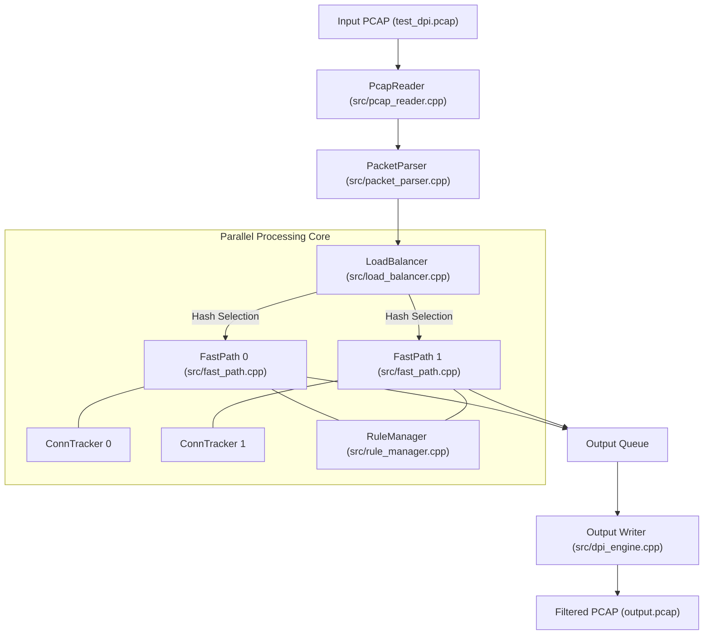

# -Packet_analyzer
Deep Packet Inspection (DPI) is a technology used to examine the contents of network packets as they pass through a checkpoint. Unlike simple firewalls that only look at packet headers (source/destination IP), DPI looks inside the packet payload.


This repository, `perryvegehan/Packet_analyzer`, is a high-performance C++ implementation of a **Deep Packet Inspection (DPI) Engine**. Its primary function is to ingest network traffic (in the form of `.pcap` files), analyze the protocol headers and payloads, identify the specific applications generating that traffic (e.g., YouTube, Netflix, Facebook), and optionally filter or block traffic based on a set of defined rules.

The project is designed to be both educational and performant. It includes a simple, single-threaded version for developers to learn the fundamentals of packet parsing and SNI (Server Name Indication) extraction, as well as a sophisticated multi-threaded architecture that utilizes load balancing and consistent hashing to scale inspection across multiple CPU cores. Unlike a standard firewall that only looks at IP addresses and ports (Layer 3/4), this engine performs "Deep" inspection by looking into the Application Layer (Layer 7) to identify domains even when the traffic is encrypted via TLS.

## 2. How all main components connect

The architecture follows a pipeline model, particularly in the multi-threaded implementation found in `src/dpi_mt.cpp`. The system is designed to handle stateful connections by ensuring that all packets belonging to the same "flow" (identified by the 5-tuple) are processed by the same execution thread.

### The Data Flow Architecture

1.  **Ingestion**: The `src/pcap_reader.cpp` component reads raw bytes from a PCAP file. It validates the global PCAP header and iterates through individual packet records.
2.  **Parsing**: The `src/packet_parser.cpp` component decodes the raw bytes into a `ParsedPacket` structure. It traverses the Ethernet header, the IP header, and the Transport header (TCP or UDP).
3.  **Dispatching (Load Balancing)**: In the multi-threaded version, a `LoadBalancer` (defined in `src/load_balancer.cpp`) calculates a hash of the packet's 5-tuple (Source IP, Destination IP, Source Port, Destination Port, Protocol). This hash determines which `FastPathProcessor` thread will handle the packet.
4.  **Inspection (The "Fast Path")**: The `src/fast_path.cpp` component is the "workhorse." It:
    *   Consults the `src/connection_tracker.cpp` to maintain the state of the conversation.
    *   Uses `src/sni_extractor.cpp` to peer into the TLS "Client Hello" packet to find the plaintext domain name.
    *   Categorizes the traffic into `AppType` constants (e.g., `AppType::YOUTUBE`) found in `include/types.h`.
5.  **Filtering**: The `src/rule_manager.cpp` checks if the identified domain, IP, or application is on a blacklist.
6.  **Output**: If the packet is not blocked, it is sent to a thread-safe queue (`include/thread_safe_queue.h`) where an output writer serializes the data back to a new PCAP file.



## 3. Repository Structure

```shell
perryvegehan/Packet_analyzer/
├── CMakeLists.txt              # Build configuration
├── README.md                   # Comprehensive project documentation
├── WINDOWS_SETUP.md            # Platform-specific instructions
├── generate_test_pcap.py       # Python script to create sample traffic
├── include/                    # Header files
│   ├── connection_tracker.h    # Flow table management
│   ├── dpi_engine.h            # Main orchestrator class
│   ├── fast_path.h             # Inspection thread logic
│   ├── load_balancer.h         # Traffic distribution
│   ├── packet_parser.h         # L2/L3/L4 parsing logic
│   ├── pcap_reader.h           # PCAP file format handler
│   ├── rule_manager.h          # Blacklist/Whitelist logic
│   ├── sni_extractor.h         # TLS/HTTP payload inspection
│   ├── thread_safe_queue.h     # Synchronization primitive
│   └── types.h                 # Shared structs (FiveTuple, AppType)
├── src/                        # Implementation files
│   ├── connection_tracker.cpp
│   ├── dpi_engine.cpp          # High-level engine logic
│   ├── dpi_mt.cpp              # Multi-threaded entry point
│   ├── fast_path.cpp
│   ├── main_working.cpp        # Simple single-threaded entry point
│   ├── packet_parser.cpp
│   ├── pcap_reader.cpp
│   ├── rule_manager.cpp
│   └── sni_extractor.cpp
└── test_dpi.pcap               # Sample input for testing
```

## 4. Other important information

### Key Technical Concepts

*   **SNI Extraction**: The core of the DPI capability resides in `src/sni_extractor.cpp`. Even though modern web traffic is encrypted with TLS/HTTPS, the "Server Name Indication" extension in the initial "Client Hello" packet is transmitted in plaintext. This engine manually parses the TLS record layer and the Handshake protocol to extract the hostname.
*   **Consistent Hashing**: To scale across multiple threads, the `src/load_balancer.cpp` uses a hash of the 5-tuple. This ensures that every packet in a specific TCP connection always lands on the same `FastPathProcessor` thread, preventing race conditions in the `src/connection_tracker.cpp` and allowing the engine to "remember" that a flow was identified as YouTube after seeing only the first few packets.
*   **Zero-Library Dependency**: A notable detail in `CMakeLists.txt` and the source code is that the project avoids heavy dependencies like `libpcap`. It implements its own PCAP reading logic in `src/pcap_reader.cpp`, making it a great resource for understanding the low-level PCAP file format.

### Tech Stack
*   **Language**: C++17 (utilizing features like `std::optional`, `std::variant`, and `std::shared_mutex`).
*   **Concurrency**: Standard C++ threads (`<thread>`) and condition variables for the producer-consumer queues.
*   **Build System**: CMake.
*   **Testing**: A Python script `generate_test_pcap.py` is provided to generate synthetic traffic, which is useful for testing the blocking rules without needing a live network capture.

### Setup and Usage
To build the project, one typically uses the standard CMake workflow:
```bash
mkdir build && cd build
cmake ..
make
```

The engine can then be run by passing an input file and blocking arguments:
```bash
./packet_analyzer input.pcap output.pcap --block-app YouTube --block-ip 192.168.1.50
```

This will process the `input.pcap`, identify all YouTube-related flows via SNI, drop those packets, and write the remaining "allowed" traffic to `output.pcap`. At the end of execution, `src/dpi_engine.cpp` generates a detailed report of application distribution and processing statistics.
